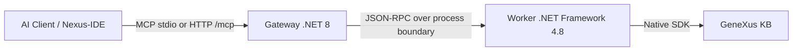

# GeneXus MCP Server — GeneXus 18 for Claude, Cursor, and AI Agents

[](https://www.npmjs.com/package/genexus-mcp)
[](https://www.npmjs.com/package/genexus-mcp)
[](https://opensource.org/licenses/MIT)
[](https://safeskill.dev/scan/lennix1337-genexus18mcp)
[](https://lobehub.com/mcp/lennix1337-genexus18mcp)

> **¿Hablás español?** → [Guía de inicio en español](docs/GETTING_STARTED.es.md)
> **Fala português?** → [Guia de início em português](docs/GETTING_STARTED.pt-br.md)
> **Stuck?** → [Troubleshooting guide](TROUBLESHOOTING.md)

---

**GeneXus MCP Server** lets AI agents — Claude Desktop, Claude Code, Cursor, Antigravity, and any MCP-compatible client — read, edit, analyze, and refactor objects inside a GeneXus 18 Knowledge Base. It talks to the **native GeneXus SDK**, so the agent works with the *real* KB, not a copy or a parsed approximation.

In practice: you point the MCP at your KB, then ask your AI assistant things like *"list all transactions with attribute CustomerId"*, *"add a rule to the Order transaction that validates the total"*, or *"refactor this procedure to use the new SDT"* — and it does it.

---

## What you can do with it

A quick map of what the agent can do against your real KB through the **47 tools** (details in [Tool Surface](#tool-surface)):

| Area | What the agent can do |
|---|---|
| 🔎 **Explore** | Search & list objects, read any part (source, rules, events, structure, docs, pattern XML), inspect metadata & callers, regex-search source, view the navigation report |
| ✏️ **Edit code** | Edit any object part (`full`/`patch`/`ops` modes), variables CRUD, format, create & delete objects, scaffold a Procedure from a **curl command**, edit + rebuild callers in one shot |
| 🗄️ **Author the data model** | Transaction structure (DSL), **unique/non-unique indexes** (create & drop), **attribute formulas & subtypes**, level Description/Image attributes, **Domain enum values**, folders & modules, table↔transaction relations & redundant-attribute detection |
| 🧩 **Author other objects** | External Object methods & properties, Menu options, REST API objects, WorkWithPlus / WorkWith patterns |
| 🎨 **UI & WorkWithPlus** | Full read/write of pattern XML (controls, actions, grids, orders, groups), theme classes & styling, native WebForm/layout edits, **control catalog & design-system tokens/classes/images**, headless-browser verification |
| 🔬 **Analyze** | Impact/dependency analysis, complexity & code metrics, naming, explain-what-this-does, KB activity/freshness, reorg/DDL impact preview, native security scan, schema-drift check |
| 🛠️ **Build, test & deploy** | Build (full or fast `compile_check`), validate, reorg, index, run native GXtest tests, deploy the application (targets + deploy) |
| 🔀 **Refactor & compare** | Rename across the KB, extract procedure, compare & merge objects (IDE parity) |
| 🌿 **Versioning, transfer & teams** | KB model versions/branches, **real XPZ export/import** (dependency-aware), GXserver (Team Development) sync + **CI pipelines**, git-style history, multi-KB parallel work |
| 🔐 **Security** | GAM / integrated-security provisioning, KB security audit + native Security Scanner |

It works through the **native GeneXus SDK** — the same code paths the IDE uses — so edits are real and validated, not text hacks on KB files.

---

## Prerequisites

Before you start, make sure you have:

- ✅ **Windows** (GeneXus is Windows-only)
- ✅ **GeneXus 18** installed locally (default path: `C:\Program Files (x86)\GeneXus\GeneXus18`)
- ✅ **A GeneXus 18 Knowledge Base** opened at least once in the IDE (so it's initialized)
- ✅ **Node.js 18+** — check with `node --version` in a terminal; install from [nodejs.org](https://nodejs.org/) if missing
- ✅ **An MCP-compatible AI client** — [Claude Desktop](https://claude.ai/download), [Claude Code](https://claude.com/claude-code), Cursor, Antigravity, etc.

You do **not** need to clone this repo or install anything globally — `npx` handles it.

**Never used a terminal before?** Press `Win+R`, type `powershell`, hit Enter. That's your terminal.

---

## Quickstart (3 steps, ~5 minutes)

### Find your two paths first

Before running the installer, note these down:

1. **GeneXus install folder** — where `GeneXus.exe` lives. Usually `C:\Program Files (x86)\GeneXus\GeneXus18`.
2. **Your KB folder** — the root folder of your Knowledge Base (contains the `.gx` file and subfolders like `Model/`, `WebSpa/`).

Not sure where your KB lives? Open it in GeneXus and check the title bar, or look in `File → Recent`.

### Step 1 — Run the installer

Open a terminal and run, replacing the paths with **your** KB folder and **your** GeneXus install:

```bash
npx genexus-mcp@latest init --kb "C:\KBs\YourKB" --gx "C:\Program Files (x86)\GeneXus\GeneXus18"
```

> Prefer the wizard? Run `npx genexus-mcp@latest init --interactive` and answer the prompts.

What you'll see (takes ~30 seconds first time, faster on re-runs):

1. `npx` downloads the package.
2. The installer verifies the paths exist and GeneXus is present.
3. It **auto-detects** which AI clients you have installed and adds the MCP config to each one.
4. Prints a JSON snippet at the end — keep it in case you need to configure a client manually.
5. Finishes with `🎉 You are all set!`.

### Step 2 — Register the MCP in your AI client

Step 1 auto-registers with Claude Desktop, Claude Code, Cursor, and Antigravity when it detects them. If yours wasn't detected, copy the JSON snippet from Step 1 into your client's MCP config manually. See the [client setup guide](TROUBLESHOOTING.md#client-setup) if unsure where that file lives.

### Step 3 — Restart your AI client, then test

This part trips most people: **fully close** your AI client and reopen it. Not just the window — the whole process.

- **Claude Desktop**: right-click the system-tray icon → **Quit**. Then launch it again. (Closing the window is not enough.)
- **Claude Code**: end the session and start a fresh one.
- **Cursor / Antigravity**: close all windows and reopen.

Then paste this prompt:

> *"Using the GeneXus MCP, list the first 5 objects in my KB and show name + type."*

**What should happen:**

- The AI invokes the `genexus_list_objects` tool (some UIs show "calling tool…").
- A few seconds later, you get a list of objects from your KB.

If you get a list back — **you're done**. Skip to [What can I ask the AI?](#what-can-i-ask-the-ai) for ideas.

If the AI says it doesn't have a GeneXus tool, or nothing happens, go to [Troubleshooting](TROUBLESHOOTING.md) — most issues are covered there.

---

## 🤖 Let your AI install it for you

If you'd rather not run anything in the terminal yourself, paste this into your AI chat:

> Please configure the GeneXus MCP server. Run `npx genexus-mcp@latest init --kb "<MY_KB_PATH>" --gx "<MY_GENEXUS_PATH>"` in the terminal. If I haven't told you my GeneXus path and KB path yet, ask me first. Once it succeeds, read the JSON block it printed and add it to my MCP client config. Tell me when I should restart the client to start using GeneXus tools.

Replace the placeholders or let the AI ask you for them.

---

## Corporate install (fixed path, ASR-friendly)

If your machine has **Microsoft Defender ASR**, **SmartScreen**, or another endpoint policy blocking unsigned binaries, the default `npx` flow is painful — `npx` caches the package under `%LOCALAPPDATA%\npm-cache\_npx\<hash>\...`, and the `<hash>` changes per version, so IT can't whitelist a stable path without a wildcard over the whole npm cache (which is too broad).

Use the corporate installer instead. It extracts the binaries to a stable directory and registers the AI clients to launch the gateway directly from there — `npx` is never on the runtime path.

```pwsh
# One-liner — installs latest release, registers AI clients
iex (irm https://raw.githubusercontent.com/lennix1337/Genexus18MCP/main/scripts/install.ps1)

# With explicit KB and GeneXus paths
$s = irm https://raw.githubusercontent.com/lennix1337/Genexus18MCP/main/scripts/install.ps1
& ([scriptblock]::Create($s)) -Kb "C:\KBs\MyKB" -Gx "C:\Program Files (x86)\GeneXus\GeneXus18"
```

Install location:

- **Admin shell** → `C:\Tools\GenexusMCP\`
- **Non-admin shell** → `%LOCALAPPDATA%\Programs\GenexusMCP\`

Paths to give to IT for the ASR / Defender exclusion list:

```
<InstallDir>\GxMcp18.Gateway.exe
<InstallDir>\worker\GxMcp18.Worker.exe
```

Re-run the same one-liner later to **upgrade** — it detects the installed version (`version.txt` in the install dir) and downloads only if a newer release is available. Use `-Force` to reinstall the same version, `-Version v2.3.0` to pin a specific tag, `-NoClient` to skip AI client registration. Node.js 18+ must be installed for client registration; without it the script still extracts the binaries but you'll need to edit the client config (`claude_desktop_config.json` etc.) manually.

---

## What can I ask the AI?

Once installed, here's what unlocks. Try these as your first prompts:

**Exploration**
- *"List all objects of type Procedure in the KB."*
- *"Show me the source of the procedure CalculateInvoiceTotal."*
- *"Find all transactions that reference the attribute CustomerId."*

**Editing**
- *"Add a rule to the Order transaction: error('Total must be positive') if Total < 0."*
- *"Add a new attribute CreatedAt of type DateTime to the Customer transaction."*
- *"Rename the variable &qty to &quantity in procedure CreateOrder."*

**Data model authoring** (no IDE round-trip)
- *"Make CustomerEmail unique on the Customer transaction."* (creates a unique index)
- *"Turn CustomerBalance into a formula: sum(InvoiceAmount)."*
- *"Add the enum values Active/Inactive/Pending to the Status domain."*
- *"Add a property apiKey and a method Connect(url) to the PaymentGateway external object."*
- *"Add a menu option 'Customers' to MainMenu that opens CustomerWW."*

**WorkWithPlus pattern editing** (full structural + theming control)
- *"In WorkWithPlusOrder, add a 'Duplicate' button to the transaction view alongside Save/Cancel/Delete."*
- *"Group the Customer transaction attributes into a 'Contact Info' section with theme class GroupTelaResp."*
- *"On the WorkWithPlusInvoice list, add a new ordering by InvoiceDate descending."*
- *"Style the Save button on WorkWithPlusOrder with buttonClass='btn ButtonGreen' and apply BigTitle to the form header."*
- *"Remove the Export action from the Selection grid of WorkWithPlusReport."*
- *"Read the Documentation part of the transaction Customer and rewrite it in markdown."*

**Analysis**
- *"Explain what the procedure ProcessShipment does, step by step."*
- *"What SQL does the query in WebPanel CustomerList generate?"*
- *"Summarize the structure of the Sales module."*

**Build & lifecycle**
- *"Build the KB and report any errors."*
- *"Run the unit tests and show me which failed."*

The agent picks the right tool from the **40+ tools** the MCP exposes (read, edit, refactor, analyze, build, data-model authoring, layout automation, DB/DDL, versioning, security, SQL preview, etc.). The full tool list is in [Tool Surface](#tool-surface) below.

---

## Supported AI clients

Auto-detected and auto-configured by the installer:

| Client | Auto-config | Notes |
|---|---|---|
| Claude Desktop | ✅ | Restart required after install |
| Claude Code (CLI) | ✅ | Reload session |
| Cursor | ✅ | Restart required |
| Antigravity | ✅ | Restart required; detected even before its MCP config exists |
| Gemini CLI | ✅ | — |
| OpenCode (CLI) | ✅ | Reads `opencode.json` / `opencode.jsonc` |
| Codex CLI | ✅ | Writes `~/.codex/config.toml` |
| VS Code / VS Code Insiders | ✅ | Native MCP (`User/mcp.json`); restart required |
| OpenCode Desktop | Detect-only | Reported as installed; add the server from the app's settings |
| Any MCP client | Manual | Use the JSON snippet printed by `init` |

Run **`npx genexus-mcp clients`** at any time to see which agents are installed, which have `genexus` registered, and whether any point at a stale gateway exe. To (re)register specific ones: `npx genexus-mcp clients add --clients antigravity,vscode`.

---

## Troubleshooting

First stop for any "the agent doesn't see GeneXus" problem: **`npx genexus-mcp clients`** (is it registered? does it point at a gateway exe that still exists?) and **`npx genexus-mcp doctor --mcp-smoke`**.

Most install issues fall into a handful of buckets — see **[TROUBLESHOOTING.md](TROUBLESHOOTING.md)** for fixes:

- Installer can't find GeneXus or the KB
- AI client doesn't see the GeneXus tools after restart
- "Worker failed to start" / .NET 4.8 errors
- KB build errors / locked artifacts
- Port 5000 already in use
- Permissions on `%LOCALAPPDATA%\GenexusMCP\`

Still stuck? [Open an issue](https://github.com/lennix1337/Genexus18MCP/issues) with the output of `npx genexus-mcp doctor --mcp-smoke`.

---

## Tool Surface

The worker exposes **47 tools** to the MCP router, grouped by capability below. Most are umbrellas with an `action` (e.g. `genexus_db action=sql_ddl`); the detailed schemas live in [`src/GxMcp.Gateway/tool_definitions.json`](src/GxMcp.Gateway/tool_definitions.json).

**Orientation & health**
- `genexus_whoami` — KB context, version, worker/index/database health, self-update check, next-step hints
- `genexus_doctor` — connection + install + cache health check
- `genexus_recipe` — named playbooks / self-extending macros
- `genexus_telemetry` — observability (metrics, latency, errors)

**Search & discovery**
- `genexus_query` — object search (prefixes `name:`, `type:`, `usedby:`, `parent:`, …)
- `genexus_list_objects` — paginated object listing with aggregates
- `genexus_read` — read any part of an object (source, structure, rules, events, docs, pattern XML, …)
- `genexus_inspect` — one-shot object snapshot (metadata, variables, structure, signature, callers)
- `genexus_search_source` — regex/semantic search across Procedure/DataProvider/WebPanel/Transaction source
- `genexus_navigation` — the IDE "View Navigation" report

For a GeneXus 18 U16 Data Selector, `genexus_read type=DataSelector` also accepts
`parameters`, `conditions`, `orders`, `definedBy`, `baseTransaction`,
`baseTable`, and `structure`. It preserves SDK order and complete expressions,
returns a `versionToken`, and performs no lifecycle operation. The public U16
SDK does not expose a projected-attribute collection or resolved joins for this
object type, so `projection` and `joins` are returned in `unsupportedParts` with
the technical reason instead of misleading empty arrays. Base objects and
declared indexes are reported only when they can be resolved without Specify.
`structure.expression` is identified as a `semanticProjection`: it combines the
typed public SDK elements and never exposes the internal collection type names
produced by `DataSelectorStructurePart.ToString()` on U16.

**Editing**
- `genexus_edit` — edit any object part; modes `full` / `patch` / `ops`
- `genexus_edit_and_build` — edit + optional specification + rebuild callers in one call, with compensating rollback on validation failure
- `genexus_edit_form` — semantic WebForm edits
- `genexus_variable` — Variables-part CRUD
- `genexus_create` — creation umbrella (Transaction, Procedure, Domain, SDT, API, Folder, Module, `curl_procedure` = scaffold a Procedure from a curl command, …); `object_atomic` authors definition + variables + Rules + properties + Source with preflight/read-back/rollback
- `genexus_delete_object` — delete an object
- `genexus_format` — format a code snippet with the worker's rules

**Data model & structure authoring**
- `genexus_structure` — read/write the data model: `get_visual`/`get_logic`, `update_visual` (structure DSL), `create_index`/`drop_index` (unique/non-unique indexes — the GeneXus way to enforce uniqueness), `set_attribute` (Formula, subtype, Title/ColumnTitle, IsCollection, basedOnDomain), `set_level` (level Description/Image attribute), `set_domain` (edit an existing Domain's enum values / base type). For `create_index`, `dryRun:true` validates and returns the projected diff without saving; use the `versionToken` from `get_indexes` as `baseVersion` for concurrency protection. A real write is re-read and verified exactly, with snapshot rollback on failure. It never triggers Specify, Generate, Build, Rebuild, compilation, reorganization, execution, or tests.
- `genexus_authoring` — members of object types the structure DSL doesn't cover: `add_external_method`/`add_external_property` (External Objects), `add_menu_option` (Menus)
- `genexus_properties` — read/update object-level properties

**Refactor, patterns & compare**
- `genexus_refactor` — rename, extract procedure, WWP condition set
- `genexus_apply_pattern` — apply a GeneXus pattern (WorkWith, WorkWithPlus, …); `mode=actions` manages typed WorkWithPlus grid actions and Action Groups
- `genexus_wwp` — WorkWithPlus Action Group / grid-action editing: `list`, `add_action`, `update_action`, `move_action`, `remove_action`
- `genexus_compare` — IDE "Compare Objects" parity (`IComparerService`)
- `genexus_merge` — 2- or 3-way object merge (`IMergeService`)

**Analysis, docs & API**
- `genexus_analyze` — cross-object semantic analysis (impact, dependencies, complexity, naming, code_metrics, summary, explain, `kb_stats` = KB activity/freshness, `table_relations` = table↔transaction relations + redundant attrs, …)
- `genexus_doc` — generate wiki / sequence diagrams / health reports
- `genexus_api` — introspect REST endpoints exposed by HTTP procedures
- `genexus_security` — audit KB security: `audit_gam` (env/GAM props), `scan_secrets` (regex over Source), `scan_native` (the SDK's own Security Scanner, `ISecurityScannerService`)

**Lifecycle, build, test & DB**
- `genexus_lifecycle` — build (incl. `compile_check`), validate, index, reorg, poll status
- `genexus_test` — run native GXtest tests
- `genexus_db` — DB umbrella: schema-drift, `sql_ddl`/`sql_navigation`, static index advisor, `sample_data`, Domain/SDT type introspection, translation import, `reorg_impact`, and non-mutating `reorg_preview` with exact DDL only from a current Impact Analysis artifact
- `genexus_deploy` — deploy application (`IDeploymentService`): `list_targets` (read) / `deploy` (destructive, `confirm=true`)
- `genexus_run_object` / `genexus_browser` — resolve runtime URL and headless-browser verification

**Native layout / UI**
- `genexus_layout` — SDK layout/WebForm ops (`get_tree`, `find_controls`, `set_property`, `add_printblock`, `get_preview`, `list_controls` = control/theme-class catalog, `design_system` = DSO tokens/classes/images, …)

**KB pool, versioning & team dev**
- `genexus_kb` — multi-KB pool (`list`/`open`/`close`/`set_default`)
- `genexus_module` — Module Manager (`IModuleManagerService`)
- `genexus_kb_version` — model version/branch management (Create/Activate/Revert)
- `genexus_versioning` — versioning umbrella (git-style history over the KB)
- `genexus_gxserver` — GXserver / Team Development sync, incl. `pipeline_*` (CI pipelines via `IContinuousIntegrationService`)
- `genexus_transfer` — real XPZ export/import (`IKnowledgeManagerService`, dependency-aware): `export` / `inspect` / `import`
- `genexus_memory` — per-KB fact store for the agent

**Security provisioning, IO & meta**
- `genexus_gam` — GAM / integrated-security provisioning (`IIntegratedSecurityService`)
- `genexus_io` — assets, part-text exchange, screenshots, OCR
- `genexus_sdk_probe` — dump the live SDK surface (types/methods/props) for capability discovery
- `genexus_worker_reload` — hot-swap the worker without restarting the client

> **Multi-KB (v2.3.0+):** every non-meta tool takes an optional `kb` argument (alias or absolute path). The gateway can hold up to `Server.MaxOpenKbs` (default 3) KBs open at once, each in its own Worker process — calls to different KBs run truly in parallel. See [Advanced Configuration](#advanced-configuration) for the `KBs[]` schema.

### WorkWithPlus & theming (via `genexus_read` / `genexus_edit`)

- Full read/write of `PatternInstance` / `PatternVirtual` XML: containers (`<table>`, groups), controls (`<textBlock>`, `<attribute>`, `<gridAttribute>`, `<filterAttribute>`, `<errorViewer>`), actions (`<standardAction>`, `<userAction>`), grids, orders, rules, event blocks. Transaction and Selection views are addressable independently.
- `Documentation` (markdown) and `Help` (HTML) are first-class write targets.
- Apply real ThemeClass values (`themeClass`, `buttonClass`, `groupThemeClass`, …); discover them with `genexus_list_objects --typeFilter ThemeClass`.

**Edit modes** (`genexus_edit`): `full` (whole-part replacement, default), `patch` (Replace/Insert_After/Append over a context anchor — works on source code AND pattern XML), `ops` (typed semantic ops like `set_attribute`, `add_rule` for source-bearing parts).

**Pattern XML auto-reconcile**: WorkWithPlus encodes IDE rendering order in a per-parent `childrenOrderedList` attribute. The MCP now rebuilds (and **creates if missing**) every list from the actual XML child order on each write — callers only describe *where* an element goes in the tree and the MCP makes the IDE render it there. The response includes a `childrenOrderedListReconciliation` block listing each (re)written parent plus any structural elements that couldn't be inferred safely.

**Safe by default**: all write tools accept `dryRun: true` (returns a preview without mutating the KB) and `idempotencyKey` (safe retries; concurrent calls coalesce, results cached 15 min).

---

## WorkWithPlus pattern editing — what you can actually do

WorkWithPlus patterns are XML documents that drive Transaction-and-Selection screens. The MCP exposes the entire surface so an agent can design or restructure a screen without opening the IDE:

| Capability | Tool / pattern | Status |
|---|---|---|
| Read `PatternInstance` / `PatternVirtual` XML | `genexus_read --part PatternInstance` | ✅ |
| Replace whole pattern (`mode: full`) | `genexus_edit --mode full --part PatternInstance` | ✅ verified live |
| Find/replace text-style patches (`mode: patch`) | `genexus_edit --mode patch --part PatternInstance --operation Replace` | ✅ verified live |
| Add / remove / reorder structural elements (textBlock, attribute, standardAction, table-as-group, order, filterAttribute, gridAttribute, eventBlock…) | XML edit + auto-reconcile | ✅ verified live |
| Theme classes (`themeClass`, `buttonClass`, `groupThemeClass`, `cellThemeClass`, `format="HTML"`) | XML attribute on the element | ✅ verified live |
| Reorganize Transaction view (form layout, action row) | edit under `/instance/transaction/...` | ✅ verified live |
| Reorganize Selection view (list/grid, filters, orders) | edit under `/instance/level/selection/...` | ✅ verified live |
| Auto-rebuild `childrenOrderedList` from XML order | done implicitly on every write; report under `childrenOrderedListReconciliation` | ✅ verified live |

**Recommended workflow for a screen redesign:**

1. `genexus_list_objects --typeFilter ThemeClass --nameFilter Button` — discover the actual button classes available in this KB (`ButtonGreen`, `ButtonBlue`, `ButtonRed`, etc — names vary per KB).
2. `genexus_read --name WorkWithPlus<Object> --part PatternInstance` — get the current XML.
3. Edit the XML in memory (LLM): wrap attributes in a `<table isGroup="True" title="…" groupThemeClass="GroupTelaResp">`, reorder buttons, add a new `<standardAction>`, attach `buttonClass="btn ButtonGreen"`, etc.
4. `genexus_edit --mode full --part PatternInstance --content "<new xml>"` — the MCP rewrites the part, reconciles `childrenOrderedList` on every container, and verifies the round-trip.
5. Read back to confirm; refresh the GeneXus IDE to see the result.

**Custom buttons use `<userAction>`, not `<standardAction>`.** `Trn_Enter` / `Trn_Cancel` / `Trn_Delete` are the only registered standard actions on a WorkWithPlus transaction; any custom button (Duplicate, Audit, Export, etc.) must be a `<userAction caption="…" name="…" buttonClass="btn ButtonGreen" confirm="False" />`. The MCP's reconciler treats `<userAction>` as a peer of `<standardAction>` (same typeCode 17/18 by context), so they coexist in the same `TableActions` row and the IDE renders them side-by-side.

**Things to know (orientation, not gotchas):**

- **WorkWithPlus normalizes some attributes after every save.** Certain fields are bound to the underlying transaction (e.g., `title` on top-level groups derives from the transaction's friendly name). When `"Apply this pattern on save"` is enabled on the WorkWithPlus object, the engine recomputes those fields — same behavior whether you edit in the IDE or via MCP. To make a hard override stick, toggle that flag via MCP:
  ```jsonc
  { "tool": "genexus_properties",
    "arguments": { "action": "set", "name": "WorkWithPlus<Object>",
                   "propertyName": "SDPlus_Editor_Apply_On_Save", "value": "False" } }
  ```
  Accepts `"True" | "False" | "Default"` (Default inherits the KB-level setting). Set back to `"Default"` to re-enable engine recomputation. Validated live in this repo.
- **Structural safety is enforced by the SDK.** If you submit XML that violates pattern invariants (e.g., a `<transaction>` without a `<level>`, or a `<standardAction>` whose `name` isn't a registered action), the SDK rejects the save and the MCP returns the exact error so you can fix the input. The KB never ends up half-written.
- **The IDE Pattern preview is a structural mockup, not a styled render.** Theme CSS (`buttonClass`, `themeClass`, fonts, colors) is resolved at runtime, not in the preview canvas — so even after a successful MCP write the preview pane will look generic. To verify styling: open the element in the IDE tree and check the right-hand **Properties panel** (the applied classes show there), or hit **Run / Live Editing** to see the real CSS. This is GeneXus IDE behavior, independent of how the pattern was edited.

---

## AXI CLI (for agents and automation)

The `genexus-mcp` command itself is also an agent-facing CLI with token-optimized output:

```bash
genexus-mcp status               # gateway/worker state
genexus-mcp doctor --mcp-smoke   # health check + protocol probe
genexus-mcp tools list           # list available tools
genexus-mcp config show          # current resolved config
genexus-mcp layout status        # native layout automation state
```

Global flags: `--format toon|json|text` · `--fields f1,f2,...` · `--limit N` · `--query <text>` · `--quiet` · `--no-color`.

Full contract: [`docs/axi_cli_contract.md`](docs/axi_cli_contract.md). Best-practices playbook: [`docs/llm_cli_mcp_playbook.md`](docs/llm_cli_mcp_playbook.md).

---

## Advanced Configuration

The installer writes a `config.json` for you. To customize networking, timeouts, or shadow paths:

```json
{
  "Server": {
    "HttpPort": 5000,
    "BindAddress": "127.0.0.1",
    "SessionIdleTimeoutMinutes": 10,
    "WorkerIdleTimeoutMinutes": 5,
    "MaxOpenKbs": 3
  },
  "GeneXus": {
    "InstallationPath": "C:\\Program Files (x86)\\GeneXus\\GeneXus18",
    "WorkerExecutable": "worker\\GxMcp18.Worker.exe"
  },
  "Environment": {
    "DefaultKb": "main",
    "KBs": [
      { "alias": "main",   "path": "C:\\KBs\\YourKB" },
      { "alias": "legacy", "path": "C:\\KBs\\OtherKB" }
    ]
  }
}
```

> **Backward compatibility:** old configs with a single `Environment.KBPath` keep working — the gateway auto-migrates them to `KBs[]` + `DefaultKb` at load time.

### Working with multiple KBs

Once you declare more than one KB in `Environment.KBs[]`, every tool accepts an optional `kb` argument:

```jsonc
// LLM example: list procedures in two KBs in parallel
{ "tool": "genexus_list_objects", "arguments": { "kb": "main",   "type": "Procedure" } }
{ "tool": "genexus_list_objects", "arguments": { "kb": "legacy", "type": "Transaction" } }
```

Resolution rules when `kb` is omitted:
- exactly 1 KB open → uses that KB
- 0 KBs open + `DefaultKb` set → opens `DefaultKb` lazily
- 2+ KBs open → server returns `KB_AMBIGUOUS` and you must pass `kb` explicitly

Manage the pool at runtime:

```jsonc
{ "tool": "genexus_kb", "arguments": { "action": "list" } }
// → { openKbs: [{alias, path, pid, workingSetMB, idleSeconds}], maxOpenKbs, defaultKb, declaredKbs }

{ "tool": "genexus_kb", "arguments": { "action": "open", "alias": "adhoc", "path": "C:/KBs/ScratchKB" } }
{ "tool": "genexus_kb", "arguments": { "action": "close", "alias": "legacy" } }
{ "tool": "genexus_kb", "arguments": { "action": "set_default", "alias": "main" } }   // persists to config.json
```

When the pool is full and no Worker is idle, the server returns `KB_POOL_FULL` — close one explicitly or raise `Server.MaxOpenKbs`. Each Worker carries the SDK in its own process (~200–400 MB idle, up to 1–2 GB on heavy KBs), so size the pool against available RAM.

### Architecture



- **Worker pool (v2.3.0+)**: one .NET 4.8 Worker process per open KB, capped by `MaxOpenKbs` (default 3). Workers are spawned lazily, recycled by `WorkerIdleTimeoutMinutes`, and evicted LRU when the pool is full.
- **Cross-KB parallelism**: tool calls to different KBs run on different Worker processes and never block each other. Calls to the same KB are still serialized by the GeneXus SDK's STA requirement.
- **Gateway reuse**: multiple IDE instances share one gateway via lease files at `%LOCALAPPDATA%\GenexusMCP\gateway-leases`.
- **HTTP mode**: also available at `http://127.0.0.1:5000/mcp` with SSE. Header: `MCP-Protocol-Version: 2025-11-25`.

---

## Development & building from source

Want to contribute or run a local dev build?

1. Clone this repo on Windows.
2. Run `.\setup.bat` — checks prerequisites, builds the C# components, and auto-registers the local build with detected AI clients.
3. If GeneXus or your KB aren't auto-detected, follow the prompts.

### Bundled AI skills (`.gemini/skills/`)

This repo ships a set of **agent skills** under `.gemini/skills/` that any MCP-compatible client with skill support (Gemini CLI, Claude Code via plugin, etc.) can load to ground its GeneXus reasoning:

| Skill | What it gives the agent |
|---|---|
| `genexus-mastery` | This repository's preferred MCP workflow + multi-KB usage |
| `genexus18-guidelines` | Local engineering rules layered on top of Nexa |
| `nexa` | Full GeneXus 18 reference set: every object type, command, type, property — imported from the official [`genexuslabs/genexus-skills`](https://github.com/genexuslabs/genexus-skills) |
| `frontend/chameleon-controls-library` | 58 Chameleon UI component specs |
| `frontend/mercury-design-system` | Mercury tokens, bundles, theming |
| `frontend/design-system-builder` | Authoring custom design systems |
| `frontend/ui-creator` | Panel/screen generation templates |

Third-party skills are Apache 2.0 (see [`.gemini/skills/NOTICE.md`](.gemini/skills/NOTICE.md)). To refresh against upstream, follow the steps in `NOTICE.md`.

### Nexus-IDE (VS Code extension — optional, not auto-installed)

`src/nexus-ide` is a lightweight, experimental VS Code extension in the repo. The installer **no longer packages or installs it** — VS Code is wired up as a native MCP client instead (see [Supported AI clients](#supported-ai-clients)). If you want the extension, build and install it manually:

```powershell
cd src/nexus-ide; npm ci; npm run compile
npx --yes @vscode/vsce package --out nexus-ide.vsix
code --install-extension nexus-ide.vsix --force
```

It provides a virtual filesystem (`genexus://` scheme), a KB explorer with multi-part editing, and MCP discovery commands.

### Automated release

- Workflow: `.github/workflows/release.yml`
- Trigger: push to `main` with a `package.json` version bump
- Behavior: publishes to npm if version is new + creates a GitHub Release tagged `v<version>`
- Required secret: `NPM_TOKEN`

---

## License

MIT — see [LICENSE](LICENSE).

> **Search keywords:** GeneXus MCP · GeneXus 18 MCP · GeneXus AI · GeneXus Claude · Model Context Protocol GeneXus · GeneXus low-code AI agent · GeneXus Cursor · GeneXus Antigravity
